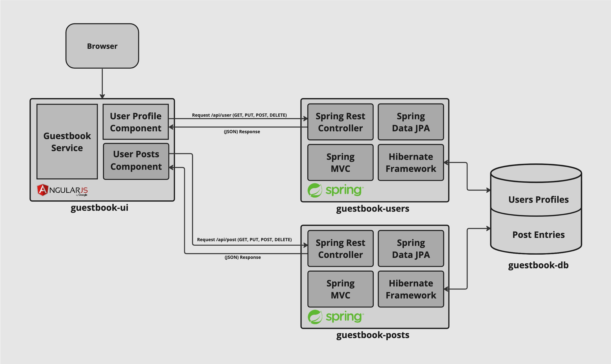

# yelb

This sample catalog and documentation corresponds to a demonstration application called [Yelb](https://github.com/mreferre/yelb).

#### Why Yelb

When experimenting with new technologies you often follow tutorials that let you deploy purpose-built simple demo application. With Yelb I wanted to make this experience the other way around: start with an existing application and adapt it to the various technologies, services and platforms you are learning. I found this to be way more fun and useful.

See [this blog post](http://www.it20.info/2018/06/compute-abstractions-on-aws/) for more information.

Yelb can be deployed (potentially) on each of these abstractions from bare metal (EC2) all the way to Lambda (serverless).

#### Yelb architecture

The current architecture layout is pretty straightforward.

There is a front-end component called `yelb-ui` that is responsable for vending the JS code to the browser. This code is compiled from an Angular 2 application. Depending on the deployment model this code can be served from an instance (EC2), from a container (Docker, Kubernetes, ECS) or from an S3 bucket (serverless). The `yelb-ui` component may also include, depending on the deployment model, an `nginx` proxy.

At the time of this writing the only application component that exists is `yelb-appserver`. This is a Sinatra application that basically read and write to a cache server (`redis-server`) as well as a Postgres backend database (`yelb-db`). Redis is used to store the number of page views whereas Postgres is used to persist the votes. Note that the `yelb-db` container image is nothing more than Postgres customized to create the database schema the application relies on. In the `serverless` deployment, new system variables has been introduced to support a DynamoDB backend (as a replacement for both redis and postgres).  

The picture below shows the architecture of Yelb:

Note: the picture above is representative of the instance (EC2) based deployment model and the container based deployment model. The serverless deployment model is architecturally different.

#### What does Yelb do?

Yelb allows users to vote on a set of alternatives (restaurants) and dynamically updates pie charts based on number of votes received. In addition to that Yelb keeps track of number of page views as well as it prints the hostname of the `yelb-appserver` instance serving the API request upon a vote or a page refresh. This allows an individual to demo the application solo, or involving people (e.g. an audience during a presentation) asking them to interact by pointing their browser to the application (which will increase the page count) and voting their favorite restaurant.    

This is how the UI looks like at this point:

# Blockchain Backstage Documentation (docs/index.md)

Welcome!  You've reached docs for the location of the Blockchain API.  This site is a [Backstage Techdocs](https://backstage.io/docs/features/techdocs/creating-and-publishing) site.  It is generated from markdown that is added to the project repository.

You can edit and add to this documentation by submitting PRs to the git repository for this project under the "catalog" directory, which is a [Backstage catalog](https://backstage.io/docs/features/software-catalog/software-catalog-overview).  

Each directory under the "catalog" directory cooresponds to a type of [Backstage entity](https://backstage.io/docs/features/software-catalog/system-model).  Those subfolders of the catalog folder have a "docs" subfolder cooresponding to the documentation definied for that entity or group of entities.

One your PR is accepted, an automated process with regenerate the documentation, and you should see your changes on the portal typically within a few minutes.
