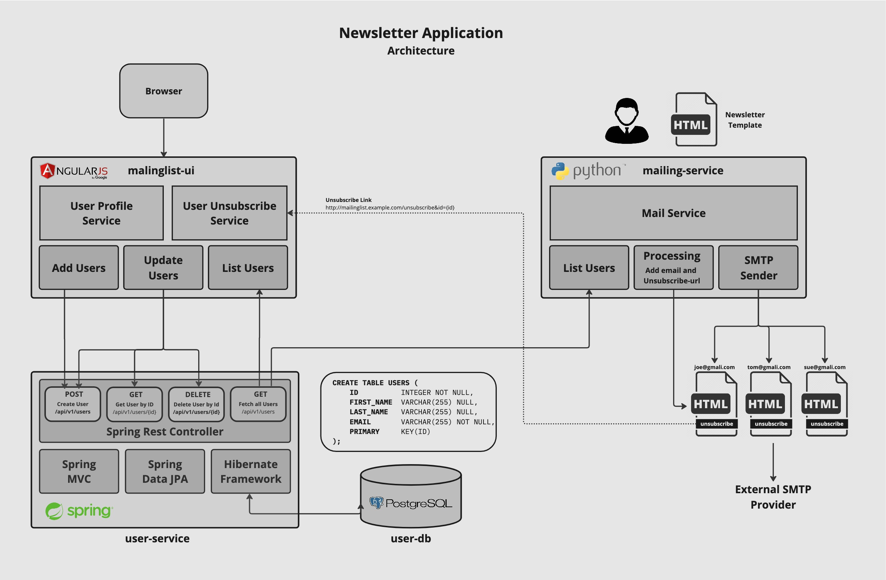

# Newsletter - Demo Application for Tanzu Applicaiton Platform (TAP)
This Project has been designed as a demo application for the Tanzu Applicaiton Platform (TAP). The Demo currently only
implements the User Profile Management as part of the Guestbook application and is basing on a
the guestbook-user-db, guestbook-user-svc and the guestbook-ui.

The picture below shows the architecture of the Guestbook Application:

## Applicaiton Components
Applicaiton Components
- guestbook-ui - Is an AngularJS Frontent for the Guestbook User Profile Management and interacts directly with the user-profile-backend
- guestbook-user-svc - Is a spring boot REST API service and acts as a backend for the User Profile Management Service
- guestbook-user-db - PostgrSQL Database backend as persistent storage for the user profiles.
- guestbook-posting-svc - Is a spring boot REST API service and acts as a backend for the User Profile Management Service
- guestbook-posting-db - PostgrSQL Database backend as persistent storage for the user profiles.

Deployment Scenarios
The Guestbook application can be deployed local on a Workstation / Laptop which usually the first choise of a developer with the limitation
that backensystems (database etc.) requires to be simulated as well as other procects API's which can not be accessed on a local environent. The second 
deployment option is on top of kubernetes cluster deployed with Tanzu Applicaiton Platform (TAP) that automaticly generate a supply chain depending 
on the applicaiotn needs. 
- Deploy on the local Laptop/Workstation
- Deploy on Kubernetes with Tanzu Applicaiton Platform (TAP)

## Setup Development Environment
### Create GitHub API Key
- Navigate to https://github.com/settings/profile
- Navigate to 'Developer Settings' in the Side Bar at the bottom
- Select 'Personal access tokens' and 'Token (classic)'
- Select 'Generate new Token (classic)"
- Enter a Name and Select Access for 'Repo' then hit 'Generate Token'

